  

  <a href="https://djyking.github.io/djyking/"><strong>个人简历 · Portfolio ↗</strong></a>
  &nbsp; / &nbsp;
  <a href="https://opsagent.cloud/"><strong>OpsAgent · 在线体验 ↗</strong></a>

### Hello, I'm He Yu.

Java 企业平台研发出身，关注复杂业务中的模块设计、公共能力与工程交付。正在把这些经验延伸到 **AI 应用、Agent 工具与工作流**，也在探索 **Python 自动化与数据研究**。

I build enterprise platforms and explore how AI and data can make useful software. My foundation is Java engineering; my current interests are AI applications, Python automation and data research.

  
  
  

### Selected work / 作品

**OpsAgent · 智能运维工作台**  
将告警、工单协作、知识依据与处置记录组织到一个工作台中，是我从企业平台研发走向 AI 应用实践的一次探索。

[打开在线体验 ↗](https://opsagent.cloud/) · [查看源码 ↗](https://github.com/djyking/opsagent)

在线体验为已完成的旧版，通过页面验证码进入；公开源码正在进行 Agent harness 改造，与在线演示并非同一版本。 / The online demo is the earlier completed version. The source is being reworked around an Agent harness.

### On my workbench / 我的工作台

| 领域 | 正在做的事 |
| :--- | :--- |
| **Engineering** | Java / Spring Boot、企业平台模块、认证权限、消息与数据协作 |
| **Applied AI** | 从 OpsAgent 出发，探索工具调用、工作流与 Agent 执行治理 |
| **Exploring** | Python 脚本与自动化、数据采集分析、量化研究方法 |

我喜欢把抽象想法做成可体验的小工具，再逐步补齐可靠性与设计。数据和量化是正在学习的兴趣方向。

---

  <strong>Build systems. Explore possibilities.</strong> 
  <a href="https://djyking.github.io/djyking/">中英文简历 · Bilingual portfolio</a> · 求职方向：杭州 / 全栈研发 · 架构方向

